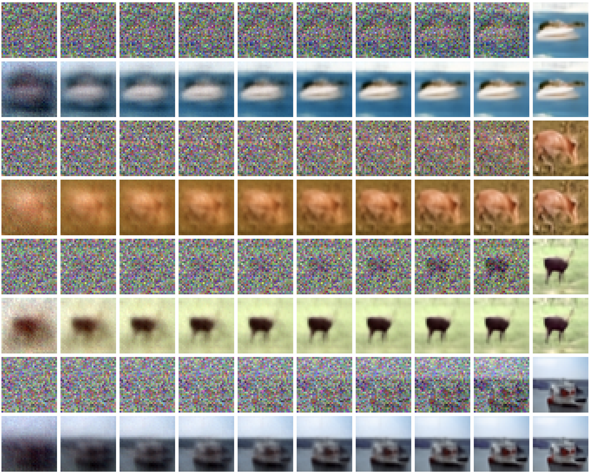

# Deterministic Diffusion Models

A `pytorch` implementation of deterministic diffusion models for image generation as described in [this post](https://incml.github.io/2023/12/20/Deterministic-Diffusion-Models.html). Source codes were adapted from [The Annotated Diffusion Model](https://huggingface.co/blog/annotated-diffusion).

```
pip install torch torchvision einops datasets

```

## Task 1: mnist-fashion


1. train UNet models using noisy images
```
> cd DDM/tasks/mnist-fashion
> python train_model.py -m ddm_noise -t 15 -e 24 -c /tmp/mnist_fashion.config /tmp/mnist_fashion.model

```

2. generating noisy images in the forward diffusion process

```
> python ../../src/diffuse.py -n 6 /tmp/mnist_fashion.config /tmp

```


3. sampling to generate images
```
> python ../../src/sampling.py -n 4 -o /tmp /tmp/mnist_fashion.config /tmp/mnist_fashion.model

```


## Task 2: mnist

1. train UNet models using noisy images
```
> cd DDM/tasks/mnist
> python train_model.py -m ddm_noise -t 15 -e 24 -c /tmp/mnist.config /tmp/mnist.model

```

2. generating noisy images in the forward diffusion process
```
> python ../../src/diffuse.py -n 6 /tmp/mnist.config /tmp

```


3. sampling to generate images
```
> python ../../src/sampling.py -n 4 -o /tmp /tmp/mnist.config /tmp/mnist.model

```


## Task 3: cifar10

1. train UNet models using noisy images
```
> cd DDM/tasks/cifar10
> python train_model.py -m ddm_noise -t 50 -e 1000 -c /tmp/cifar10.config /tmp/cifar10.model

```

2. generating noisy images in the forward diffusion process
```
> python ../../src/diffuse.py -n 6 /tmp/cifar10.config /tmp

```


3. sampling to generate images
```
> python ../../src/sampling.py -n 4 -o /tmp /tmp/cifar10.config /tmp/cifar10.model

```

