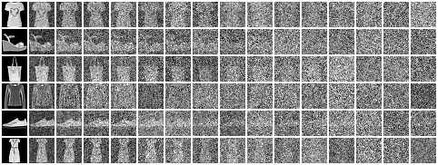
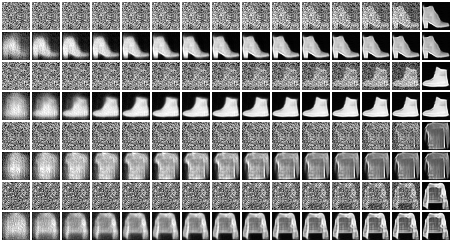

# Deterministic Diffusion Models

A `pytorch` implementation of deterministic diffusion models for image generation as described in [this post](https://incml.github.io/2023/12/20/Deterministic-Diffusion-Models.html). Source codes were adapted from [The Annotated Diffusion Model](https://huggingface.co/blog/annotated-diffusion).

```
pip install torch torchvision einops datasets

```

## Task 1. mnist-fashion


1. train UNet models using noisy images
```
> cd DDM/tasks/mnist-fashion
> python train_mnist_fashion.py -m ddm_noise -t 15 -e 24 -c /tmp/mnist_fashion.config /tmp/mnist_fashion.model

```

2. generating noisy images in the forward diffusion process

```
> python diffuse_mnist_fashion.py -n 64 /tmp/mnist_fashion.config /tmp/

```
<div style="text-align: center">

<figcaption> forward diffusion process </figcaption>
</div>


3. sampling to generate images
```
> python ../../src/sampling.py -n 64 -o /tmp /tmp/mnist_fashion.config /tmp/mnist_fashion.model

```
<div style="text-align: center">

<figcaption> sampling process to generate images deterministically  </figcaption>
</div>
